# SwissJewellery

SwissJewellery is a modern online jewelry store with Swiss-inspired design.  
The project is built as a fullstack e-commerce application with user and admin roles.

🔗 Website: https://swiss-jewellery.vercel.app/

---

## 🧩 Project Structure

The project consists of two main parts:

| Folder  | Description                     |
|---------|---------------------------------|
| client/ | Frontend (React)                |
| server/ | Backend (Node.js, Express API)  |

---

## 🚀 Features

### Header
- Catalog
- Login and registration for unauthenticated users
- Profile and logout for authenticated users
- Admin panel for administrators
- Cart

### Catalog
- View all products
- Filters by categories and other parameters
- Product cards
- Product details page
- Order products
- Add products to favorites

### Cart
- View products in the cart
- Change quantity
- Clear cart
- Checkout functionality

### Admin Panel
- Available only to authorized administrators
- Product catalog with filters and full CRUD (create, update, delete)
- Category management with CRUD
- View user orders with status management

### Profile
- View user information
- View user role (admin / user)
- List of user orders
- List of favorite products

---

## 📦 Technologies

### Frontend
- React
- SCSS (responsive design)
- TanStack Query

### Backend
- Node.js
- Express
- MongoDB

### Deployment
- Vercel (frontend)
- Render (backend)

---

## 🛠 Installation

Clone the repository:

```
git clone https://github.com/levtoshi/SwissJewellery.git
```

Install frontend dependencies:

```
cd client
npm install
```

Install backend dependencies:

```
cd server
npm install
```

Create a .env file for the backend:

```
# MongoDB
MONGO_URI=YOUR_MONGO_DB_URL

# Server
PORT=5000
NODE_ENV=development

# JWT Secrets
JWT_ACCESS_SECRET=your_super_secret_access_key_change_this_in_production
JWT_REFRESH_SECRET=your_super_secret_refresh_key_change_this_in_production

# JWT Expiration
JWT_ACCESS_EXPIRES_IN=1d
JWT_REFRESH_EXPIRES_IN=7d

# Allowed Origins
ALLOWED_ORIGINS=http://localhost:5173
# In production change to your frontend domain (https://swiss-jewellery.vercel.app)
```

In /src/api/axios.js, replace the `baseURL` for local development (do not change it for production):

```
baseURL: `/api`, // for production via Vercel rewrites
```

with:
```
baseURL: `http://localhost:YOUR_PORT/api`,
```

## ✅ Run Locally
In two terminals at the same time:

```
cd client
npm run dev
```

```
cd server
npm run dev
```

## 🌐 Deployment
First, deploy the backend to Render as a Web Service (Node.js):
https://dashboard.render.com/

Then configure .env variables for production.

Next, update the destination in /vercel.json from:

```
"destination": "https://swissjewellery.onrender.com/api/$1"
```

to:

```
"destination": "https://your-domain.onrender.com/api/$1"
```

Then deploy the frontend to Vercel:
https://vercel.com/

## 👤 User Roles
user — regular user (catalog, cart, orders, favorites)

admin — product, category, and order management (plus all user features)

## 🔑 Authentication & Security
JWT tokens are used for user authentication:

AccessToken — stored in localStorage, valid for 1 day

RefreshToken — stored in MongoDB and sent via httpOnly cookie, valid for 7 days

## 🖼️ Screenshots

### Catalog
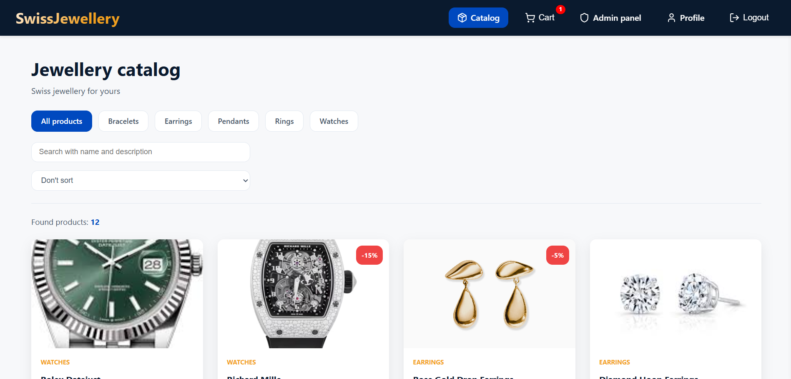

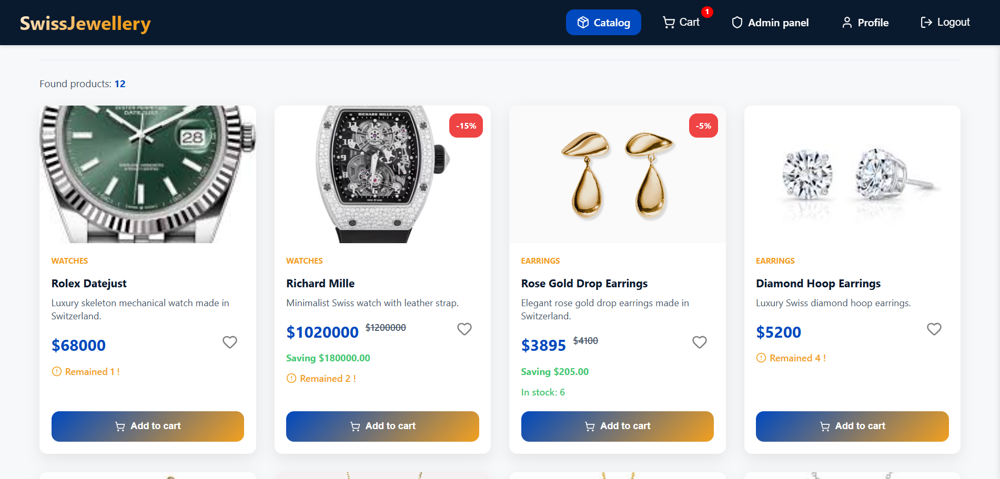

### Product Details
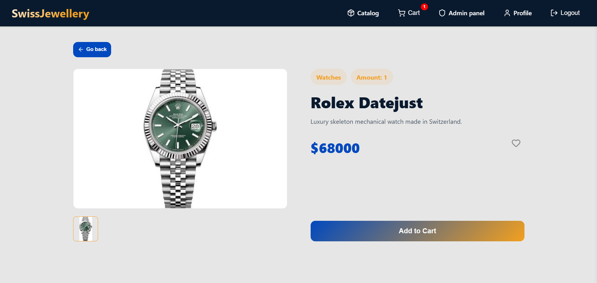

### Cart
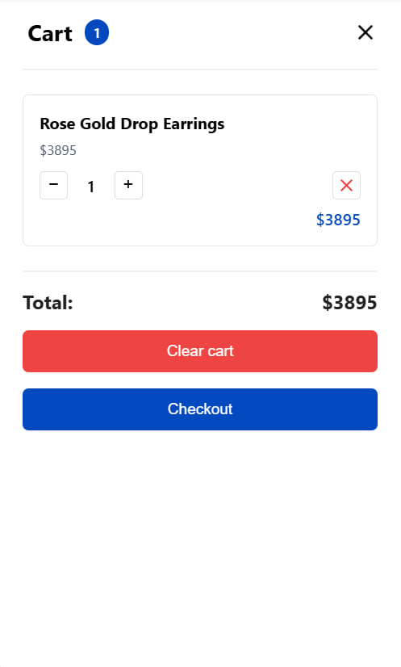

### Checkout
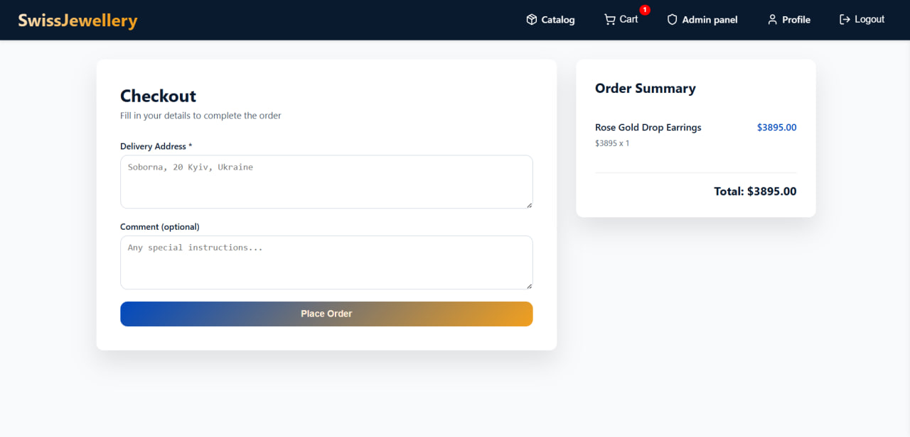

### Admin Panel (Products)
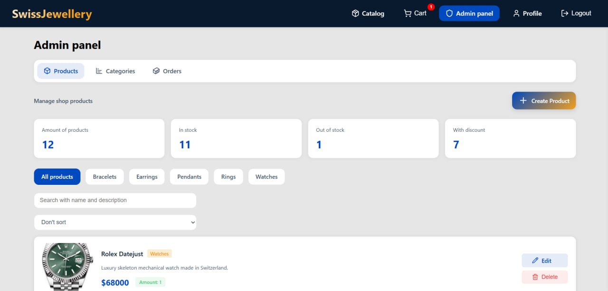

### Admin Panel (Categories)
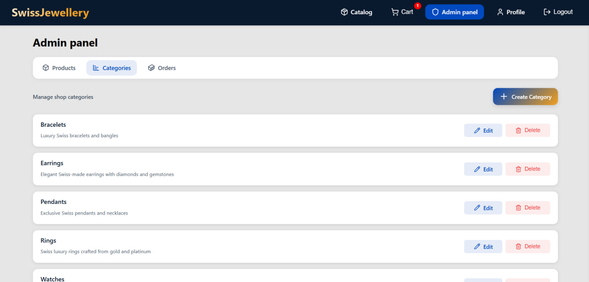

### Admin Panel (Orders)
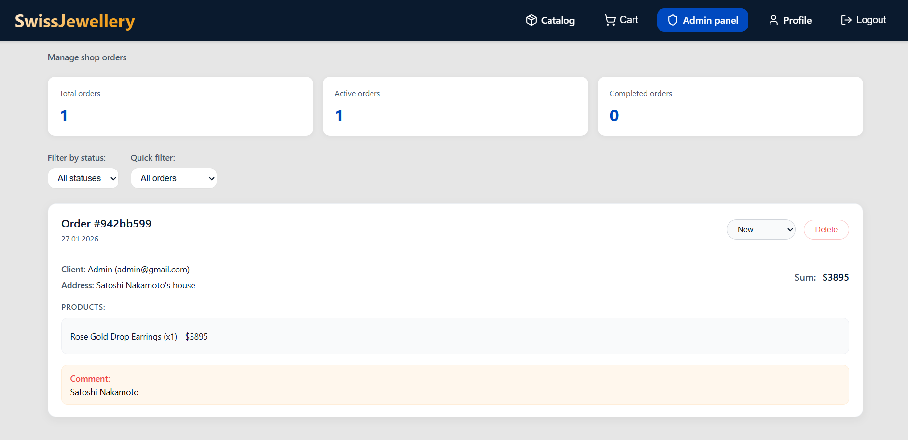

### User Profile
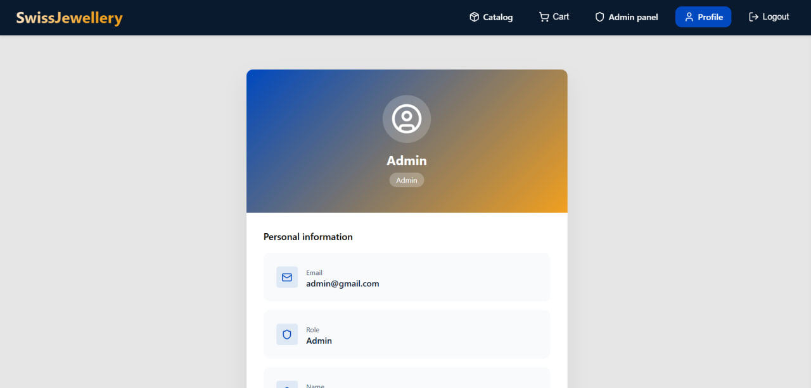

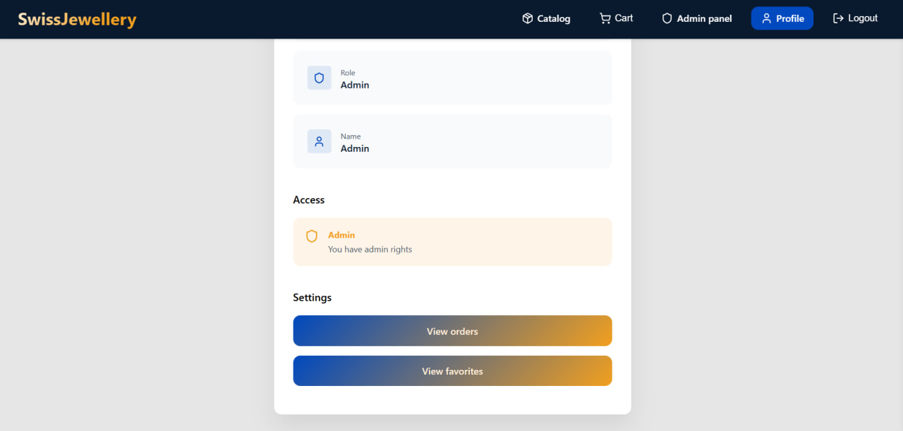

### Favorites
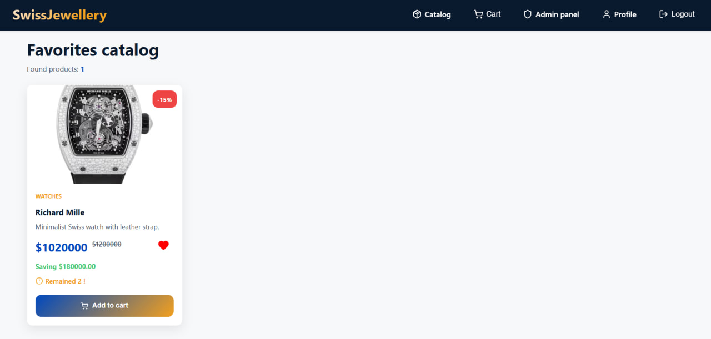

### User Orders
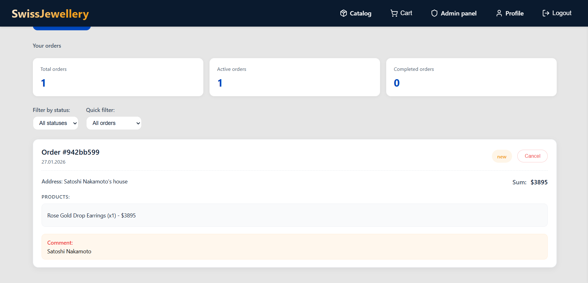